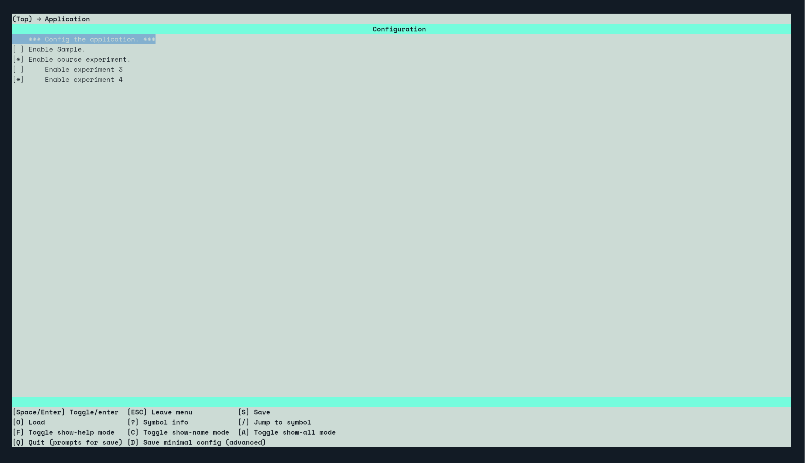

# DLUT-SHDF-Course
大连理工大学 2024级智能硬件设计基础课程资料 包含部分实验代码

## 背景

大连理工大学2024级新添加了课程智能硬件设计基础
该课课程由理论课和实验课组成，实验课具有一定难度。
此仓库是进行代码与课程资料和经验的总结，以便给后来人参考。

目前只上传了实验三和实验四的代码

## 使用方法
- [ppt](./ppt) 中为理论课的代码
- [experiment_report](./experiment_report/) 中为老师发的实验报告模板
- [schemaic](./schematic/) 中为小车的原理图
- [code](./code/) 中为 ws63 的sdk和实验代码

### Windows

由于我是在linux端编写代码的所以并未使用海思提供的HiSparkIDE，因此无法提供在Windows下的使用方法。欢迎其他人补充。

## Linux

首先克隆本项目
~~~
git clone --recursive https://github.com/fulatin/DLUT-SHDF-Course.git

~~~

进入 `code/src` 执行 `python ./build.py -c ws63-liteos-app menuconfig`
在`Application` 中选中 `Enable course experiment` 在子选项中可以选择某个实验(目前只有实验三和四的 欢迎pr)

保存并退出。

之后输入
~~~
python ./build.py -c ws63-liteos-app
~~~
即可编译代码，随后的烧录可以使用[xf_burn_tools](https://github.com/geekheart/xf_burn_tools)这个工具。

烧录的示例代码为
~~~
burn -p /dev/ttyUSB0 DLUT-SHDF-Code/src/output/ws63/fwpkg/ws63-liteos-app/ws63-liteos-app_all.fwpkg
~~~

其中`/dev/ttyUSB0` 为linux下连接到小车的串口文件`DLUT-SHDF-Code/src/output/ws63/fwpkg/ws63-liteos-app/ws63-liteos-app_all.fwpkg`
为编译后需要烧录的文件的位置(以.fwpkg结尾，一般在`code/src/output/ws63/fwpkg/ws63-liteos-app/` 中可找到)
